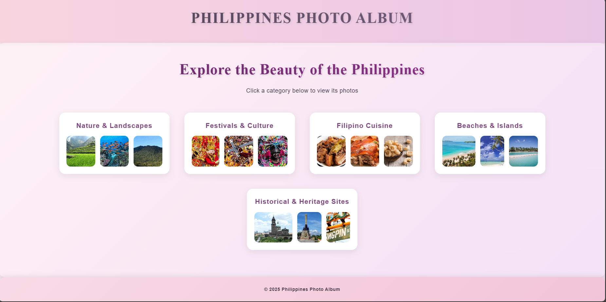
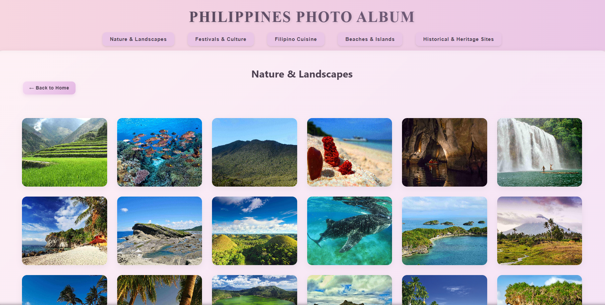
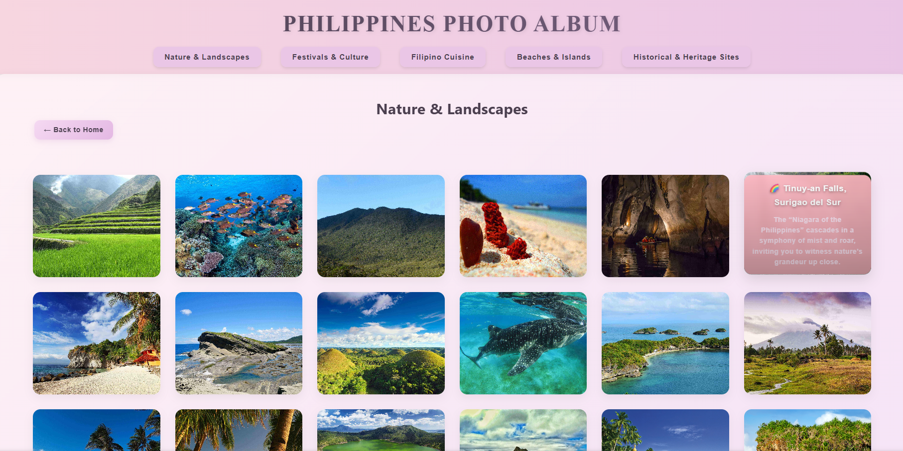
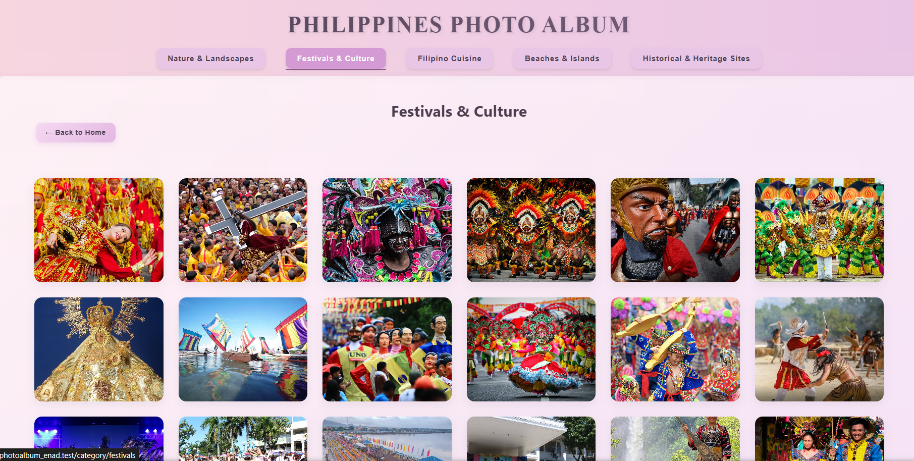
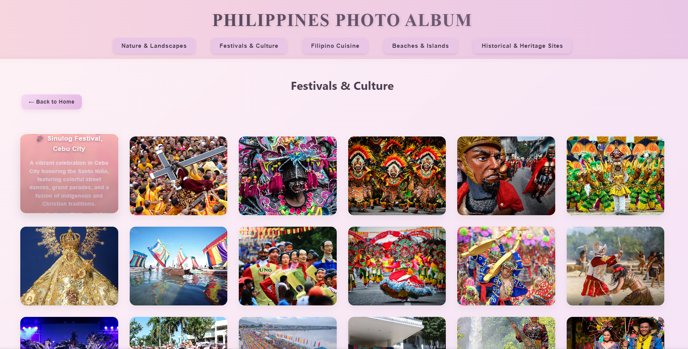
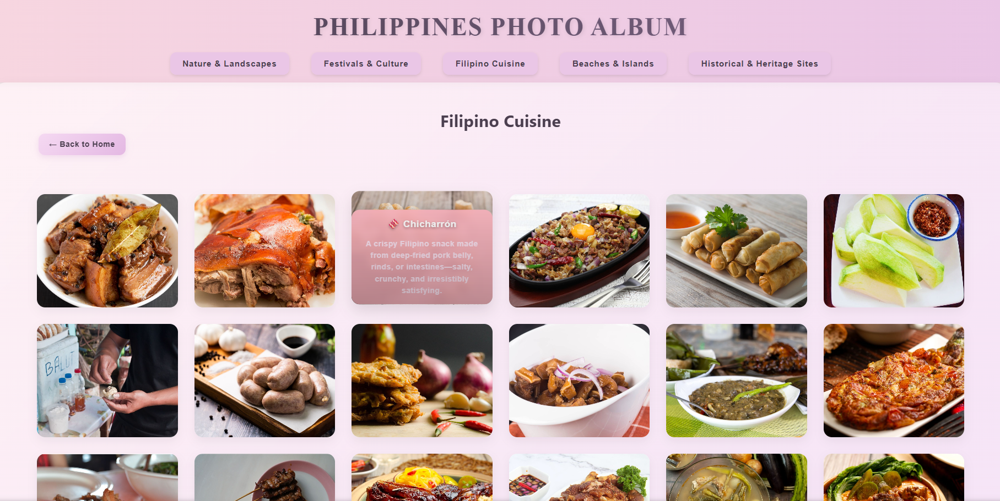
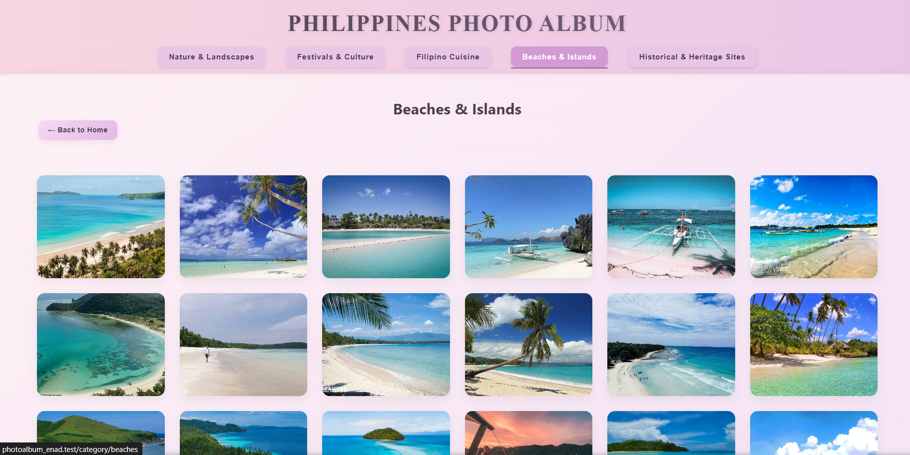
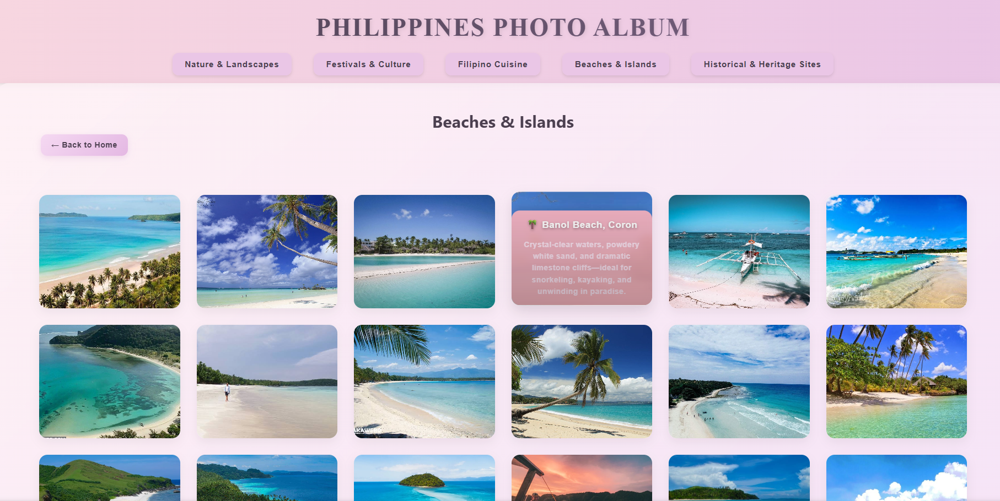
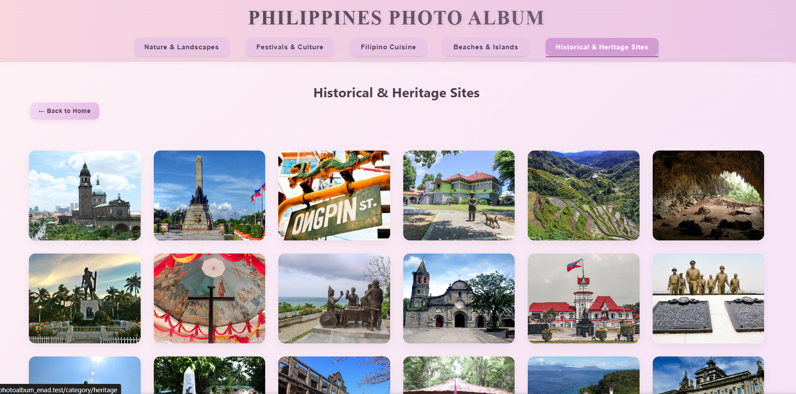
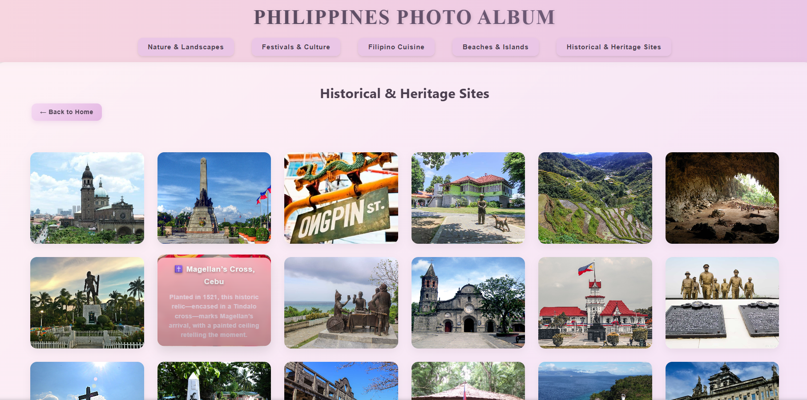

# photoAlbum_Enad

## Program: Bachelor of Science in Information Technology

## Program Activity Title: LAB ACTIVITY: PHOTO ALBUM WEB APPLICATION (LARAVEL FRAMEWORK)

## Kristyl Faith Enad

## Site Description

**My Philippine Photo Album** is a Laravel-based web application that showcases the beauty, culture, cuisine, and heritage of the Philippines through images.

The album is organized into five categories: **Nature**, **Festivals**, **Food**, **Beaches**, and **Heritage**. Each image is accompanied by a **title and caption**, providing context and storytelling about each location, tradition, or dish.

---

## Categories & Highlights

**</b>Page 1: Nature and Landscapes</b>**
<i>Explore the breathtaking natural beauty of the Philippines—from misty mountain terraces and majestic volcanoes to pristine beaches, lush forests, and vibrant coral reefs. Each photo captures the wonder, serenity, and raw splendor of the country’s most iconic landscapes.</i>

🌿 Nature (20 Images)

1. **Ifugao, Cordillera Region** – In the heart of the Cordilleras, ancient hands sculpted stairways that kiss the clouds. Come when the terraces shimmer green—before the rains fall, before the crowds arrive.
2. **Tubbataha Reefs, Palawan** – A diver’s dream beneath sapphire waves—thriving corals, graceful giants, and skies alive with wings.
3. **Mount Hamiguitan, Davao Oriental** – Though its summit is off-limits, the mountain’s magic unfolds below—pygmy forests, rare species, and trails that whisper secrets of a living heritage.
4. **Great Santa Cruz Island, Zamboanga** – Where pink sands meet turquoise tides, a hidden gem invites you to stroll along shores kissed by the sun and serenaded by gentle waves.
5. **Puerto Princesa Underground River, Palawan** – Journey into the earth’s embrace—where limestone cathedrals rise, and nature’s artistry is etched in stone and shadow.
6. **Tinuy-an Falls, Surigao del Sur** – The “Niagara of the Philippines” cascades in a symphony of mist and roar, inviting you to witness nature’s grandeur up close.
7. **Apo Island, Negros Oriental** – Turtles glide, corals bloom—snorkel or dive this island gem, just a banca ride away.
8. **Biri Island, Northern Samar** – Where ocean giants clash, ancient rocks rise—weathered by time, sculpted by waves, and best explored at low tide.
9. **Chocolate Hills, Bohol** – Born of a giant’s grief, these thousand hills rise like kisses from the earth—mystical mounds stretching across 50 square kilometers, each one shaped by time and legend.
10. **Donsol, Sorsogon** – Where giants glide and reefs come alive—swim with whale sharks from March to May, or dive into the vibrant depths of Ticao and San Miguel from February to October.
11. **Hundred Islands, Pangasinan** – A seascape of dreams—where over a hundred islands rise from emerald waters, each one a canvas for adventure, relaxation, and nature’s splendor.
12. **Mayon Volcano, Albay** – The world’s most perfectly shaped volcano—its symmetrical cone rising majestically, a testament to nature’s artistry and power.
13. **Pagudpud, Ilocos Norte** – Where windswept beaches meet azure seas—Pagudpud beckons with its pristine shores, rolling hills, and the promise of endless horizons.
14. **Siquijor, Central Visayas** – An island of mystique and magic—Siquijor enchants with its waterfalls, coral reefs, and the timeless allure of its folklore.
15. **Taal Volcano & Lake, Batangas** – A volcano within a lake, within an island—Taal’s surreal landscape invites you to explore its trails, witness its beauty, and feel the pulse of nature’s wonders.
16. **Mt. Batulao, Batangas** – Rolling hills and rugged peaks—Mt. Batulao offers hikers panoramic views, cool breezes, and trails that wind through pine forests and grasslands.
17. **Boracay Island, Aklan** – Famed for its powdery white sands and vibrant nightlife, Boracay is a tropical paradise that captivates visitors with its crystal-clear waters and stunning sunsets.
18. **Siargao Island, Surigao del Norte** – The surfing capital of the Philippines—Siargao’s waves beckon thrill-seekers, while its lagoons, caves, and rock pools offer serene escapes.
19. **Mount Pulag, Luzon** – The third highest peak in the Philippines—Mount Pulag is renowned for its “sea of clouds,” diverse flora and fauna, and breathtaking sunrises.
20. **Puerto Galera, Oriental Mindoro** – A haven for divers and beach lovers—Puerto Galera boasts vibrant coral reefs, crystal-clear waters, and a laid-back island vibe that enchants every visitor.

**<b>Page 2: Festivals</b>**
<i>Celebrate the vibrant spirit of the Philippines through its colorful festivals. From grand street parades and lively dances to rich cultural traditions, each event showcases the nation’s heritage, faith, and joyful community life.</i>

🎉 Festivals (20 Images)

1. **Sinulog Festival, Cebu City** – A vibrant celebration honoring the Santo Niño, featuring colorful street dances, grand parades, and a fusion of indigenous and Christian traditions.
2. **Feast of the Black Nazarene, Manila** – An intense religious event where millions of devotees participate in a grand procession seeking blessings and miracles.
3. **Ati-Atihan Festival, Kalibo, Aklan** – Known as the "Mother of All Philippine Festivals," with street dancing and vibrant costumes.
4. **Dinagyang Festival, Iloilo City** – Showcases energetic street dances, elaborate costumes, and a tribute to the Santo Niño, reflecting the rich heritage of the Ilonggo people.
5. **Moriones Festival, Marinduque** – A unique Lenten festival where locals don colorful Roman soldier costumes, reenacting the story of Longinus.
6. **Pintados-Kasadyaan Festival, Tacloban City** – Featuring traditional dances, body painting, and cultural performances honoring indigenous roots.
7. **Peñafrancia Festival, Naga City** – A grand religious festival with a fluvial procession, vibrant street parades, and community activities.
8. **Zamboanga La Hermosa Festival, Zamboanga City** – Celebrating the city’s patroness with street dances, floral floats, and heritage showcases.
9. **Higantes Festival, Angono, Rizal** – Festival featuring giant papier-mâché figures celebrating artistic heritage and patron saints.
10. **MassKara Festival, Bacolod City** – Known for smiling masks, lively street dances, and festive spirit of the Negrense people.
11. **Kadayawan Festival, Davao City** – Week-long celebration of Mindanao’s indigenous tribes with street dances and cultural presentations.
12. **Kadaugan sa Mactan Festival, Lapu-Lapu City** – Historical reenactment commemorating the Battle of Mactan with colorful costumes and parades.
13. **Sarakiki-Hadang Festival, Calbayog City, Samar** – Celebration of the patron saint San Bartolome with street dances and cultural performances.
14. **Sinadya sa Halaran Festival, Roxas City, Capiz** – Celebrating the patron saint with street dances, cultural shows, and community spirit.
15. **Kasanggayahan Festival, Butuan City** – Showcasing local culture through street dances and colorful parades.
16. **Catandungan Festival, Catanduanes** – Festival celebrating the province’s culture with street dances and cultural presentations.
17. **T’boli Tribal Festival (Lemlunay Festival), Lake Sebu, South Cotabato** – Honoring ancestral dreams, music, and weaving.
18. **Pahiyas Festival** – Homes transform into artful displays of harvest bounty, celebrating gratitude and Filipino creativity.
19. **Lanzones Festival, Mambajao** – Celebrates the lanzones fruit with color, dance, and festivity.
20. **Panagbenga Festival, Baguio City** – A blooming spectacle where flowers take center stage in grand floats and vibrant street dances.

**<b>Page 3: Food & Delicacies</b>**
<i>Savor the rich flavors of Filipino cuisine, from traditional favorites to regional specialties. This page showcases iconic dishes that reflect the Philippines’ diverse culinary heritage and vibrant food culture.</i>

🍲 Food (20 Images)

1. **Adobo** – Braised meat in vinegar, soy sauce, garlic, and spices; rich, savory, and uniquely Filipino.
2. **Lechon** – Whole roasted pig with crispy skin; iconic Filipino feast centerpiece.
3. **Chicharrón** – Deep-fried pork belly or rinds; salty, crunchy, and satisfying.
4. **Pork Sisig** – Kapampangan dish of chopped pork face, ears, and liver; crispy, creamy, tangy.
5. **Lumpia** – Thin crepe rolls with pork and vegetables; served with sweet dipping sauce.
6. **Mangga’t Bagoong** – Sour green mango slices with fermented shrimp paste; street food staple.
7. **Balut** – Fertilized duck egg with embryo; adventurous Filipino snack.
8. **Longganisa** – Sweet or savory sausage; breakfast favorite with garlic rice and eggs.
9. **Okoy** – Rice batter fritters with shrimp and veggies; served with vinegar dip.
10. **Tokwa’t Baboy** – Fried tofu and pork belly in vinegar-soy sauce mix; simple and savory.
11. **Laing** – Taro leaves in coconut milk with chili and spices; rich, spicy Bicolano stew.
12. **Torta** – Filipino omelet, often with ground meat or eggplant; served with banana ketchup.
13. **Pinakbet** – Stir-fried pork and local vegetables in shrimp/fish sauce; earthy and bold.
14. **Pork Barbecue** – Skewered, marinated pork grilled over charcoal; sweet-savory and smoky.
15. **Chicken Inasal** – Charcoal-grilled, marinated chicken with vinegar, calamansi, pepper, annatto.
16. **Crispy Pata** – Deep-fried pork trotters with soy-vinegar dip; indulgent and crunchy.
17. **Sinigang** – Tangy soup with tamarind or local fruits; sour, savory comfort food.
18. **Kare-Kare** – Oxtail, pork, and veggies in peanut sauce; served with bagoong.
19. **Tinola** – Chicken soup with green papaya, moringa, chili leaves; mild and comforting.
20. **Liempo** – Garlic-chili-soy marinated grilled pork; smoky, tender, perfect with rice.

**<b>Page 4: Beaches</b>**
<i>Discover the Philippines’ stunning coastline, from powdery white sands to crystal-clear waters. This page highlights serene shores, hidden coves, and vibrant island escapes perfect for relaxation and adventure.</i>

🏖️ Beaches (20 Images)

1. **Nacpan Beach** – Powdery white sand, twin shores, turquoise waters; perfect for sunsets.
2. **White Beach, Boracay** – Famous white sands, vibrant nightlife, crystal-clear waters.
3. **Kota Beach, Bantayan** – Laid-back vibes, kayaking, seafood, sunset views.
4. **Banol Beach, Coron** – Clear waters, limestone cliffs, snorkeling, kayaking.
5. **Alona Beach, Bohol** – White sands, coral reefs, fresh seafood by the shore.
6. **Mahabang Buhangin Beach** – Long white sands, tranquil waters, ideal for walks.
7. **Anguib Beach, Cagayan** – Hidden gem with limestone cliffs and clear waters.
8. **Gumasa Beach, Sarangani** – Powdery sand, crystal waters, SarBay Festival highlight.
9. **Dahican Beach, Davao Oriental** – Surfing paradise with white sands and turtle sightings.
10. **Saud Beach, Pagudpud** – Pristine waters, ideal for kiteboarding, near Bangui Windmills.
11. **Malamawi Beach, Basilan** – Bright waters, powdery sand, peaceful escape.
12. **Paliton Beach, Siquijor** – White sand, sandbars, perfect for quiet sunsets.
13. **Morong Beach, Batanes** – Crystal waters, dramatic cliffs, Ivatan culture.
14. **Bitaog Beach, Dinagat Islands** – Limestone cliffs, hidden rock formations, serene shore.
15. **Bonbon Beach, Romblon** – Low-tide sandbar, marble rocks, sun, sea, and caves.
16. **Alegria Beach, Siargao** – Undeveloped, quiet shores, island tours, golden sunsets.
17. **Subic Beach, Sorsogon** – Turquoise waters, Tikling Island sandbar, snorkeling.
18. **Buhatan Beach, Albay** – Soft sands, gentle waves, ideal for relaxation.
19. **Antonia Beach, Gigantes Islands** – White sand, limestone cliffs, pure island charm.
20. **Pink Beach, Sila Island** – Blush-pink sands, vibrant reefs, serene snorkel escape.

**<b>Page 5: Historical & Heritage Sites</b>**
<i>Explore the Philippines’ rich history and cultural heritage through its iconic landmarks, monuments, and ancestral sites. This page highlights places that tell the story of the nation’s past, traditions, and enduring legacy.</i>

🏛️ Heritage (20 Images)

1. **Intramuros, Manila** – Cobblestone streets, historic churches, colonial architecture.
2. **Rizal Park, Manila** – Honoring memory, culture, and nationhood.
3. **Binondo, Manila** – Filipino-Chinese heritage, trade history, street food.
4. **Rizal Shrine, Calamba** – Traditional bahay na bato, relics, and library.
5. **Banaue Rice Terraces** – Ancient Ifugao terraces, rich in tradition and mountain views.
6. **Tabon Caves, Palawan** – Home to Tabon Man, Manunggul Jar, and 200+ caves.
7. **Mactan Shrine, Cebu** – Historic site marking the battle between Lapu-Lapu and Magellan.
8. **Magellan’s Cross, Cebu** – Encased in Tindalo wood; painted ceiling retells history.
9. **Blood Compact Site, Bohol** – The site of Sandugo, symbol of unity and friendship.
10. **Barasoain Church, Malolos** – Cradle of the Malolos Congress and Filipino resistance.
11. **Aguinaldo Shrine, Cavite** – Birthplace of Philippine independence, home of first flag-raising.
12. **MacArthur Landing Memorial, Leyte** – Commemorates MacArthur’s return, bronze statues in Leyte Gulf.
13. **Mount Samat Shrine, Bataan** – WWII heroes memorial with Memorial Cross and Colonnade museum.
14. **Bataan Death March Markers** – 138 obelisks tracing the harrowing 1942 march.
15. **Corregidor Island** – Ruins like Malinta Tunnel and Mile-Long Barracks, wartime reminders.
16. **Rizal Park and Shrine, Dapitan** – Rizal’s exile home, heritage site with landmarks.
17. **Limasawa Island, Southern Leyte** – Site of first Philippine mass in 1521.
18. **University of Santo Tomas, Manila** – Asia’s oldest university; alma mater of heroes.
19. **Cagsawa Ruins, Albay** – Belfry stands after Mayon eruption; testament to resilience.
20. **Calle Crisologo, Vigan** – Historic cobblestone street lined with Spanish-era houses.

---

## Features

-   Laravel routing
-   Blade templating
-   Pagination / manual page navigation
-   Custom CSS styling
-   Proper folder structure
-   Images properly displayed without missing links

---

## Navigation

**Home Page**
⦁ Welcomes users with the main heading “My Photo Album.”
⦁ Provides links to all five categories: Nature & Landscapes, Festivals, Beaches, Food & Delicacies, and Historical & ⦁ Heritage Sites.

**Back Button**
⦁ Allows users to return to the previous page or category easily.
⦁ Keeps navigation simple and intuitive while exploring images.

**Category Title in Header**
⦁ Always visible at the top of the page.
⦁ Clickable, letting users switch to any other category instantly.
⦁ Provides quick access to all sections without going back to the Home Page.
⦁ Serves as the central hub for exploring the Philippines’ rich beauty and culture.

## Screenshot of Sample Output

<h3><b><i>Home Page:</b> Serves as the main gateway, welcoming users and providing quick access to all photo categories.</i></h3>

  

<h3><b><i>Nature and Landscapes Page:</b> Showcases the Philippines’ breathtaking natural wonders, from mountains and waterfalls to islands and coral reefs.</i></h3>

  

  

<h3><b><i>Festivals Page:</b>Highlights the vibrant and diverse cultural celebrations of the Philippines through colorful images and lively events.</i></h3>

  

  

<h3><b><i>Food & Delicacies Page:</b> Showcases the rich and flavorful Filipino cuisine, featuring iconic dishes and local specialties.</i></h3>

  

  

<h3><b><i>Beaches Page:</b> Highlights the Philippines’ stunning coastal destinations, featuring white sands, crystal-clear waters, and island paradises.</i></h3>

  

  

<h3><b><i>Historical & Heritage Sites Page:</b> Showcases the Philippines’ rich history and culture through landmarks, monuments, and heritage sites.</i></h3>

  

  

